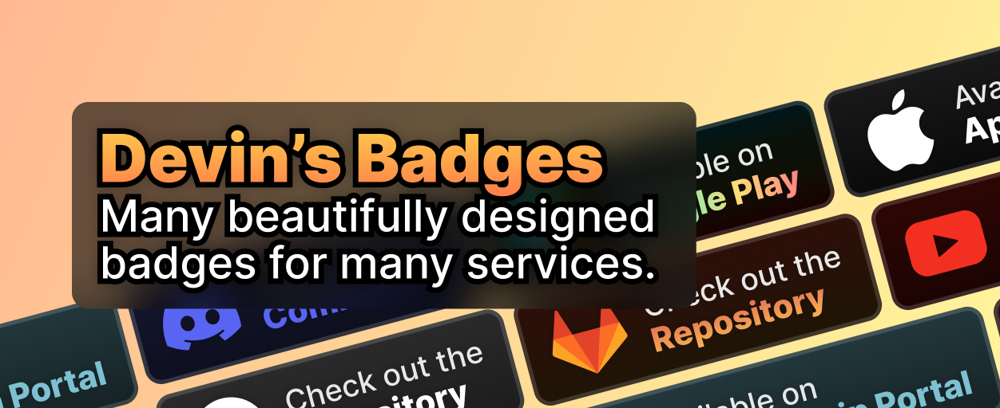

# 
## ❓ About
This is Devin's Badges! A project I work on in my spare time that contains cool badges for you to use in your projects.

I aim to be as consistent as possible with these. I also try to make these look great on most modern sites.

## 📰 Using in your project
Adding these badges to your website? I recommend you use the `_64h` files if possible, to lower bandwidth usage for your users and because 64 pixel height is a good size for these badges.

All you really need to do is copy these depending on what you are using this with:

Markdown - ``

You don't need to add credit - it would be nice for you to do so, but I really don't care if you do or not. I just make these for fun!

## ➕ Adding more badges
Want to add your own badges to the project? Feel free to open up an issue and I'll make one! This project is made with Figma. If you are opening a PR, I will probably edit your badge just to make sure it fits in as well as possible with the rest.

## ❗ Disclaimer
This is currently a work in progress, I only have a few badges for a few services right now. However, I am planning to have a lot more badges in the next couple weeks.